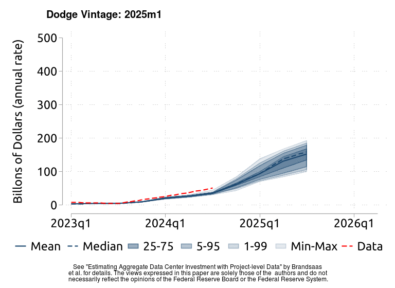
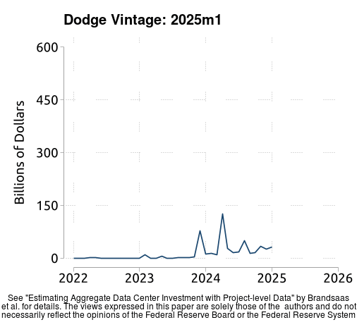
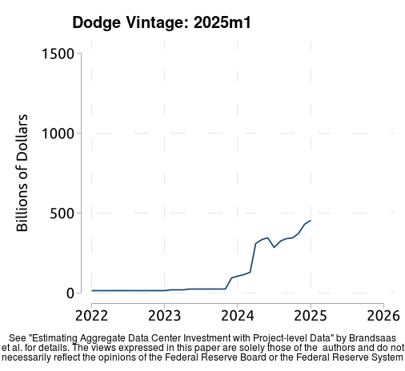
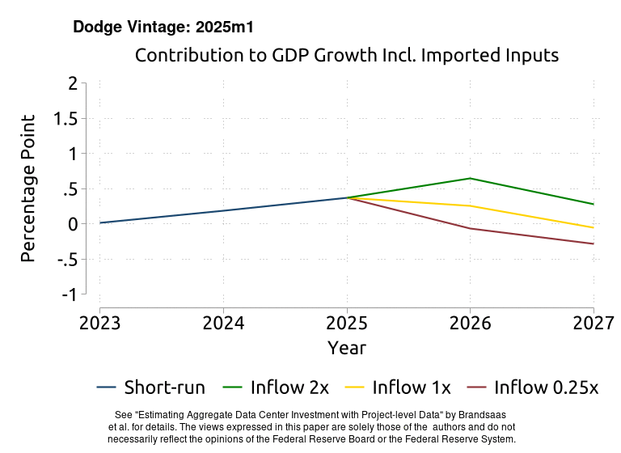
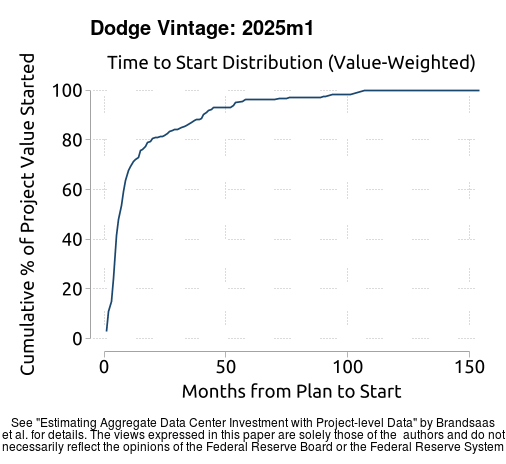
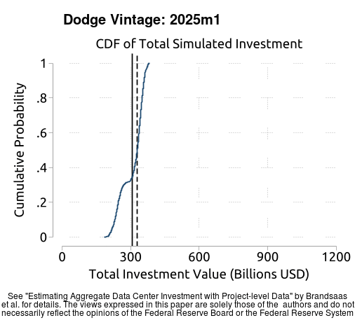
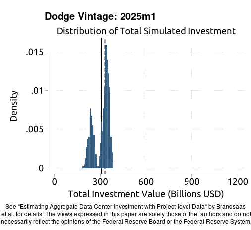

# Readme

This git repository contains all the code and materials to replicate "Estimating Aggregate Data Center Investment with Project-level Data" by Brandsaas, Garcia, Kurtzman, Nichols, and Zytek.

The December 2025 working paper is available at https://www.federalreserve.gov/econres/feds/files/2025109pap.pdf. 

Our main result, Figure 3(a), displays our estimate, nowcast, and forecast for data center investment (annualized, billions of dollars) over the near term. Below, we reproduce the figure and show how it has evolved across vintages of the Dodge microdata. The "data" line is constant since it always uses the most recent vintage of BEA data. 

Below we show how the other charts evolved over vintages of the Dodge microdata.

## Animated Pictures

### Figure 2: Value of New Plans and Planning Stock over Time
The left panel plots the flow of projects entering planning, right panel plots the stock.

### Figure 3: Data Center Investment
The first panel plots the short-run forecast, that does not depend on the assumed path of new projects. The right panel plots a longer-run forecast, where the outcomes (and uncertainty) is determined by the path of new projects. In the left panel, the red line will always refer to the most recent estimate using all available BEA data.

### Table 2: Data Center Investment
This figure re-produces the center columns of the table, that is the GDP contributions including imports and thus overstates the true impact of datacenter investment. See text for details.

### Figure S2: Time-to-Start CDF

### Figure S3: Distribution of Short-Run Simulated Investment

## Replication Instructions

1. Clone the project to your desired location:
   - e.g., `git clone https://gitlab.rsma.frb.gov/m1eeb00/res_data_center.git`
   - Note: This will create a new folder `res_data_center` in the current working directory

2. Update the file paths in the following files:
   - `Main.R` - Set the path to where the Dodge data is located
   - `runall.do` - Set the path to where `res_data_center/` is located
   - `BEA_data.do` - Set the path to the Fame database for loading BEA data
     * Note: This is only used to create measures of historical aggregate data center investment and is not used in the forecast itself. This step can be skipped. It also relies on the Board-internal `fameuse` Stata command

3. Navigate to the code directory:
   - e.g., `cd res_data_center/code`

4. Run the main script:
   - e.g., `sh run.sh`
   - As of January 2026, this takes about 3 hours to run. Most of the time is spent iteratively creating the vintage data sets. The stata code takes about 30 minutes.
   - This program runs all the required code:
      * The R code (`Main.r`) can be run separately. It cleans and stacks all the Dodge data. This is very slow if you don't have enough memory and threads.
      * The Stata code (`runall.do`) can be run separately. It calculates statistics, runs simulations, and generates plots. This should take 1-5 minutes depending on your computer, per vintage.
      * The R script (`create_vintage_gifs.R`) create `.gif`s that illustrate the evolution of the data over vintages of Dodge data. This should take about a minute.

### Things to Note

1. In some places, the code pulls data from internal databases. All of this data is available from other sources (e.g., directly from the BEA), but for our convenience we access it from internal databases.

2. In `plot_sims.do`, the data from the Survey of Professional Forecasters is manually entered.
3. The R-code generates vintage-specific panels (stored as `.csv`.) The Stata code then loops over these vintages. In the `figures/` directory, the stored .pdf and .tex will simply be the most recent vintage. 
